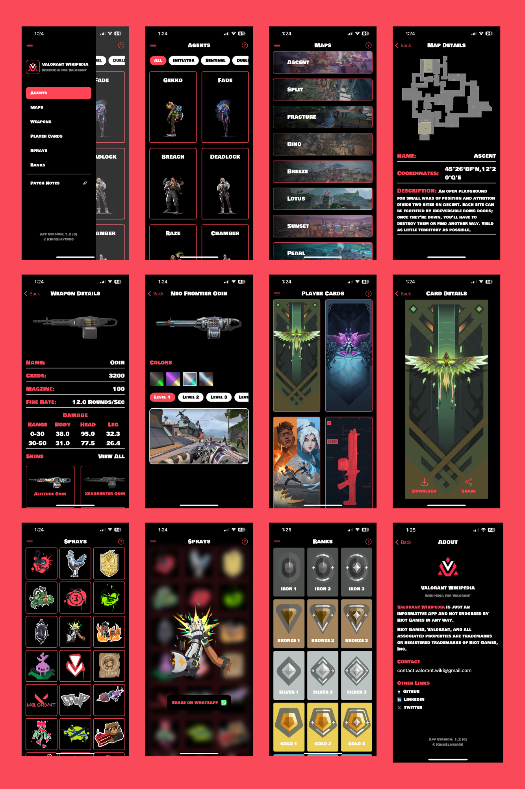

# Valorant Wikipedia

Valorant Wikipedia is a wikipedia for Valorant game developed by Riot Games. You can find all the helpful information about the game in this app!

## Get Started

1\. Install Xcode. We currently support XCode 15.0.1 Swift 5.9.

2\. Clone this repository.

## Screenshots

## Dependencies

I have made heavy use of the following projects, and so it can be helpful to be familiar with them:

- [Valorant-API](https://valorant-api.com/): An extensive API containing data of most valorant in-game items, assets and more!

- [MVVM Clean Architecture](https://github.com/kudoleh/iOS-Clean-Architecture-MVVM)

Other frameworks I used:
- [Kingfisher](https://github.com/onevcat/Kingfisher)
- [Alomofire](https://github.com/Alamofire/Alamofire)
- [Firebase](https://github.com/firebase/firebase-ios-sdk)

## Demo

- [App Demo](Images/demo.mp4)

## Acknowledgements

 - Valorant Wikipedia is just an informative App and not endorsed by Riot Games in any way.
 - Riot Games, Valorant, and all associated properties are trademarks or registered trademarks of Riot Games, Inc.

## 🔗 Support Me

